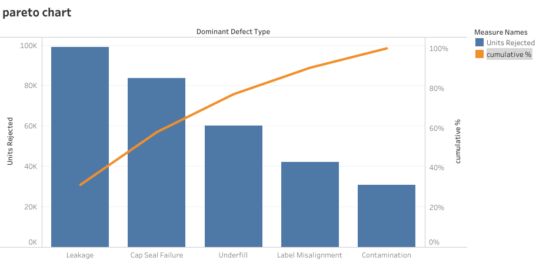
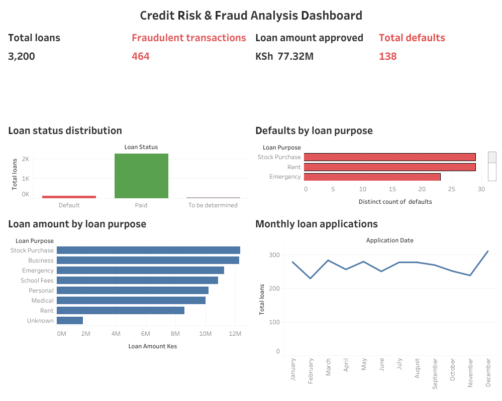

< alt="Charity Kabui — Data Analyst & Geospatial Data Scientist">

# Charity Kabui

**Data Analyst & Geospatial Data Scientist**

[LinkedIn](https://www.linkedin.com/in/charitykabui) · [GitHub](https://github.com/kabui-charity) · [Portfolio](https://kabui-charity.github.io) · [Email](mailto:charitykabui254@gmail.com)

---

## About

I turn business data into decisions — about where the money is, where the growth is, and where the risk sits. I'm a Geomatics Engineering graduate who moved into analytics because the skill is the same: reading for what's true beneath the surface.

## What Sets Me Apart

Most analysts work with tables. I also work with **space** — combining GIS/geospatial analysis with data science and ML to answer not just *what* is happening, but *where* it's happening, and *why*.

## Core Stack

Python · SQL · Pandas · NumPy · Power BI · Tableau · Excel · PostgreSQL · PostGIS · QGIS · ArcGIS · GeoPandas · Jupyter

## Featured Projects

### Manufacturing Downtime Root Cause Analysis
**Operational Risk & Root Cause Analysis**

Traced a Kenyan production line's reject-rate spike (1.6% → 6.6%) back to its actual root causes, not just its symptoms.
- Prioritised defect categories with a Pareto analysis, then mapped candidate causes across machine, method, material and manpower on a fishbone diagram
- Confirmed the shift was a real process change with a P-chart, and ruled out shift/operator effects along the way

**Stack:** Python · Pareto Analysis · Root Cause Analysis
**Repo:** [manufacturing-root-cause-analysis](https://github.com/kabui-charity/manufacturing-root-cause-analysis)

---

### Wekeza Analytics — Kenya Fintech BI Suite
**Credit Risk & Fraud Analysis**

Built a Tableau suite giving a fintech one place to see loan risk and irregular transaction activity across mobile money, agency banking and digital lending.
- Loan risk view tracking default rate, portfolio at risk and days-late by segment and county
- Fraud KPI surfacing flagged transactions alongside the loan book

**Stack:** Tableau · SQL · Credit Risk Analysis
**Repo:** [credit-risk-and-fraud-analysis](https://github.com/kabui-charity/credit-risk-and-fraud-analysis)

---

### Geospatial Participation Intelligence — Govern
**GIS & Market Growth**

Mapped where engagement concentrates across Tshwane Region 1 to guide targeted marketing and expansion decisions.
- Indexed activity data with H3 hexagonal spatial bins
- Ran Getis-Ord Gi* hotspot statistics in Python to find statistically significant clusters, not just raw density

**Stack:** Python · GeoPandas · H3 · Folium
**Repo:** [geospatial-participation-intelligence](https://github.com/kabui-charity/geospatial-participation-intelligence)
[View the live interactive map on my portfolio](https://kabui-charity.github.io)

## Background

**BSc. Geomatics Engineering & Geospatial Information Systems**
Dedan Kimathi University of Technology

**Certifications:** Women Techsters Fellowship (Excel & Power BI) · Google Data Analytics Professional Certificate · Google Business Intelligence

## Experience

- **Data Science Intern, Govern** — Geospatial & data analysis for a community tech platform
- **Assistant Data Field Officer, KEPSA** — Field-level verification of large-scale business data
- **Land Surveyor, Ubuntu Geodigital Technologies** — Surveying and geospatial techniques in land-related projects and field data collection
- **Community Management, CSA Africa Alumni** — Managed engagement across a ~250-member alumni community

## Open to Roles In

Data Analytics · Data Science · GIS / Geospatial Analytics · Business Intelligence · M&E Data · Machine Learning

---

Let's turn data into decisions.

charitykabui254@gmail.com · [LinkedIn](https://www.linkedin.com/in/charitykabui) · [Portfolio](https://kabui-charity.github.io)
